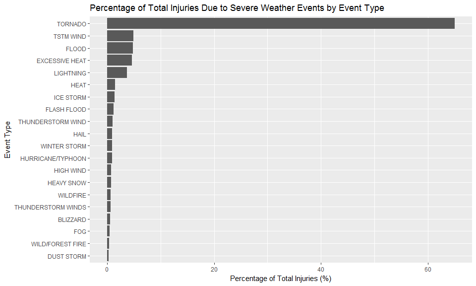
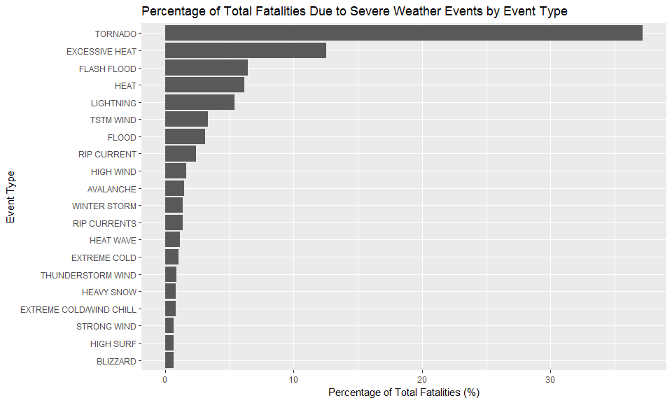
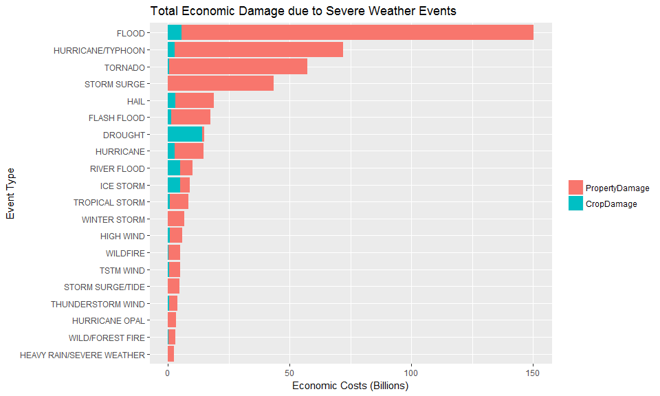

# Wind and Water are Primary Contributors to Economic Damage, Population Health Risk
John B Cheadle  
July 6, 2017  

## Synopsis
This data analysis attempts to identify the **severe weather event types** that are the greatest contributors to estimated injuries, fatalities, and property damage in the United States.  Here we use the NOAA storms database; this database tracks characteristics of major storms and weather events in the United States, including when and where they occur, as well as estimates of any fatalities, injuries, and property damage.  We find that the severe weather events with the highest incident of fatalities are tornadoes (37.2%), heat (18.75% for excessive heat + heat) and flash floods (6.46%).  Similarly, the highest incident of injuries come about with tornadoes (65.0%), thunderstorm winds (4.95%), flooding (4.83%), and excessive heat (4.64%).  For economic consequences, we considered only those which had monetary impact in the thousands (K), millions (M), or billions (B).  The vast majority of economic damage is caused to property as opposed to crops, and the primary contributors here in order of severity are floods, typhoons, tornadoes, and storm surges.  Taken together, we conclude that wind and water are the primary severe weather events resulting in the greatest economic damage and which pose the greatest risk to population health.

## Data Processing
### Downloading the Raw Data
Data was downloaded on 03 JUL 2017 at 2:30 PM EST from [this location.](https://d396qusza40orc.cloudfront.net/repdata%2Fdata%2FStormData.csv.bz2)  
Additional information regarding documentation of and frequently asked questions (FAQs) about the database are found [here](https://d396qusza40orc.cloudfront.net/repdata%2Fpeer2_doc%2Fpd01016005curr.pdf) and [here](https://d396qusza40orc.cloudfront.net/repdata%2Fpeer2_doc%2FNCDC%20Storm%20Events-FAQ%20Page.pdf), respectively.


```r
## Downloading Raw Data
fileURL <- "https://d396qusza40orc.cloudfront.net/repdata%2Fdata%2FStormData.csv.bz2"
if(!(file.exists("StormData.csv.bz2"))) {
    download.file(url = fileURL, destfile = "./StormData.csv.bz2")
}
stormdata <- read.csv("StormData.csv.bz2")
```

### Quick look at data
First, we look at a few different quick summaries of the data that will be important for our analysis.

```r
## Loading appropriate libraries for downstream analysis
require(dplyr)
```

```
## Loading required package: dplyr
```

```
## Warning: package 'dplyr' was built under R version 3.3.3
```

```
## 
## Attaching package: 'dplyr'
```

```
## The following objects are masked from 'package:stats':
## 
##     filter, lag
```

```
## The following objects are masked from 'package:base':
## 
##     intersect, setdiff, setequal, union
```

```r
require(ggplot2)
```

```
## Loading required package: ggplot2
```

```r
require(reshape2)
```

```
## Loading required package: reshape2
```

```r
## Summaries
dim(stormdata)
```

```
## [1] 902297     37
```

```r
str(stormdata)
```

```
## 'data.frame':	902297 obs. of  37 variables:
##  $ STATE__   : num  1 1 1 1 1 1 1 1 1 1 ...
##  $ BGN_DATE  : Factor w/ 16335 levels "1/1/1966 0:00:00",..: 6523 6523 4242 11116 2224 2224 2260 383 3980 3980 ...
##  $ BGN_TIME  : Factor w/ 3608 levels "00:00:00 AM",..: 272 287 2705 1683 2584 3186 242 1683 3186 3186 ...
##  $ TIME_ZONE : Factor w/ 22 levels "ADT","AKS","AST",..: 7 7 7 7 7 7 7 7 7 7 ...
##  $ COUNTY    : num  97 3 57 89 43 77 9 123 125 57 ...
##  $ COUNTYNAME: Factor w/ 29601 levels "","5NM E OF MACKINAC BRIDGE TO PRESQUE ISLE LT MI",..: 13513 1873 4598 10592 4372 10094 1973 23873 24418 4598 ...
##  $ STATE     : Factor w/ 72 levels "AK","AL","AM",..: 2 2 2 2 2 2 2 2 2 2 ...
##  $ EVTYPE    : Factor w/ 985 levels "   HIGH SURF ADVISORY",..: 834 834 834 834 834 834 834 834 834 834 ...
##  $ BGN_RANGE : num  0 0 0 0 0 0 0 0 0 0 ...
##  $ BGN_AZI   : Factor w/ 35 levels "","  N"," NW",..: 1 1 1 1 1 1 1 1 1 1 ...
##  $ BGN_LOCATI: Factor w/ 54429 levels "","- 1 N Albion",..: 1 1 1 1 1 1 1 1 1 1 ...
##  $ END_DATE  : Factor w/ 6663 levels "","1/1/1993 0:00:00",..: 1 1 1 1 1 1 1 1 1 1 ...
##  $ END_TIME  : Factor w/ 3647 levels ""," 0900CST",..: 1 1 1 1 1 1 1 1 1 1 ...
##  $ COUNTY_END: num  0 0 0 0 0 0 0 0 0 0 ...
##  $ COUNTYENDN: logi  NA NA NA NA NA NA ...
##  $ END_RANGE : num  0 0 0 0 0 0 0 0 0 0 ...
##  $ END_AZI   : Factor w/ 24 levels "","E","ENE","ESE",..: 1 1 1 1 1 1 1 1 1 1 ...
##  $ END_LOCATI: Factor w/ 34506 levels "","- .5 NNW",..: 1 1 1 1 1 1 1 1 1 1 ...
##  $ LENGTH    : num  14 2 0.1 0 0 1.5 1.5 0 3.3 2.3 ...
##  $ WIDTH     : num  100 150 123 100 150 177 33 33 100 100 ...
##  $ F         : int  3 2 2 2 2 2 2 1 3 3 ...
##  $ MAG       : num  0 0 0 0 0 0 0 0 0 0 ...
##  $ FATALITIES: num  0 0 0 0 0 0 0 0 1 0 ...
##  $ INJURIES  : num  15 0 2 2 2 6 1 0 14 0 ...
##  $ PROPDMG   : num  25 2.5 25 2.5 2.5 2.5 2.5 2.5 25 25 ...
##  $ PROPDMGEXP: Factor w/ 19 levels "","-","?","+",..: 17 17 17 17 17 17 17 17 17 17 ...
##  $ CROPDMG   : num  0 0 0 0 0 0 0 0 0 0 ...
##  $ CROPDMGEXP: Factor w/ 9 levels "","?","0","2",..: 1 1 1 1 1 1 1 1 1 1 ...
##  $ WFO       : Factor w/ 542 levels ""," CI","$AC",..: 1 1 1 1 1 1 1 1 1 1 ...
##  $ STATEOFFIC: Factor w/ 250 levels "","ALABAMA, Central",..: 1 1 1 1 1 1 1 1 1 1 ...
##  $ ZONENAMES : Factor w/ 25112 levels "","                                                                                                                               "| __truncated__,..: 1 1 1 1 1 1 1 1 1 1 ...
##  $ LATITUDE  : num  3040 3042 3340 3458 3412 ...
##  $ LONGITUDE : num  8812 8755 8742 8626 8642 ...
##  $ LATITUDE_E: num  3051 0 0 0 0 ...
##  $ LONGITUDE_: num  8806 0 0 0 0 ...
##  $ REMARKS   : Factor w/ 436781 levels "","-2 at Deer Park\n",..: 1 1 1 1 1 1 1 1 1 1 ...
##  $ REFNUM    : num  1 2 3 4 5 6 7 8 9 10 ...
```

```r
head(stormdata)
```

```
##   STATE__           BGN_DATE BGN_TIME TIME_ZONE COUNTY COUNTYNAME STATE
## 1       1  4/18/1950 0:00:00     0130       CST     97     MOBILE    AL
## 2       1  4/18/1950 0:00:00     0145       CST      3    BALDWIN    AL
## 3       1  2/20/1951 0:00:00     1600       CST     57    FAYETTE    AL
## 4       1   6/8/1951 0:00:00     0900       CST     89    MADISON    AL
## 5       1 11/15/1951 0:00:00     1500       CST     43    CULLMAN    AL
## 6       1 11/15/1951 0:00:00     2000       CST     77 LAUDERDALE    AL
##    EVTYPE BGN_RANGE BGN_AZI BGN_LOCATI END_DATE END_TIME COUNTY_END
## 1 TORNADO         0                                               0
## 2 TORNADO         0                                               0
## 3 TORNADO         0                                               0
## 4 TORNADO         0                                               0
## 5 TORNADO         0                                               0
## 6 TORNADO         0                                               0
##   COUNTYENDN END_RANGE END_AZI END_LOCATI LENGTH WIDTH F MAG FATALITIES
## 1         NA         0                      14.0   100 3   0          0
## 2         NA         0                       2.0   150 2   0          0
## 3         NA         0                       0.1   123 2   0          0
## 4         NA         0                       0.0   100 2   0          0
## 5         NA         0                       0.0   150 2   0          0
## 6         NA         0                       1.5   177 2   0          0
##   INJURIES PROPDMG PROPDMGEXP CROPDMG CROPDMGEXP WFO STATEOFFIC ZONENAMES
## 1       15    25.0          K       0                                    
## 2        0     2.5          K       0                                    
## 3        2    25.0          K       0                                    
## 4        2     2.5          K       0                                    
## 5        2     2.5          K       0                                    
## 6        6     2.5          K       0                                    
##   LATITUDE LONGITUDE LATITUDE_E LONGITUDE_ REMARKS REFNUM
## 1     3040      8812       3051       8806              1
## 2     3042      8755          0          0              2
## 3     3340      8742          0          0              3
## 4     3458      8626          0          0              4
## 5     3412      8642          0          0              5
## 6     3450      8748          0          0              6
```

```r
## Looking at EVTYPE
length(levels(stormdata$EVTYPE))
```

```
## [1] 985
```

```r
head(levels(stormdata$EVTYPE), n = 15)
```

```
##  [1] "   HIGH SURF ADVISORY" " COASTAL FLOOD"       
##  [3] " FLASH FLOOD"          " LIGHTNING"           
##  [5] " TSTM WIND"            " TSTM WIND (G45)"     
##  [7] " WATERSPOUT"           " WIND"                
##  [9] "?"                     "ABNORMAL WARMTH"      
## [11] "ABNORMALLY DRY"        "ABNORMALLY WET"       
## [13] "ACCUMULATED SNOWFALL"  "AGRICULTURAL FREEZE"  
## [15] "APACHE COUNTY"
```

It appears the fields that will be relevant to our analysis are as follows:

* EVTYPE
* FATALITIES
* INJURIES
* PROPDMG
* PROPDMGEXP
* CROPDMG
* CROPDMGEXP

Another consideration we make is that since EVTYPE has 985 values, we won't be able to represent every weather type on our charts.  We'll have to look at the top handful which makes up the majority of the impact.

### Processing the Raw Data - Injuries & Fatalities
Injuries & fatalities are listed in a pretty straight-forward manner; the class of each field is numeric, and the sums of both fields are easy to calculate.

```r
class(stormdata$INJURIES)
```

```
## [1] "numeric"
```

```r
class(stormdata$FATALITIES)
```

```
## [1] "numeric"
```

```r
sum(stormdata$INJURIES)
```

```
## [1] 140528
```

```r
sum(stormdata$FATALITIES)
```

```
## [1] 15145
```
We have about 10x as many injuries reported as we do indirect fatalities.

We want to summarize the injury and fatality data based on event type for future analysis; to do this, we create two aggregate objects.

```r
## Create the population health aggregate, listing injuries and fatalities by event type
injury_agg <- aggregate(stormdata$INJURIES, by=list(EventType=stormdata$EVTYPE), 
                        FUN=sum, na.rm=TRUE)
fatality_agg <- aggregate(stormdata$FATALITIES, by=list(EventType=stormdata$EVTYPE), 
                        FUN=sum, na.rm=TRUE)
```
We next sort these in descending order and view the top 20 results (because there are 985 event types, viewing all of them would be impractical).


```r
injury_agg <- injury_agg[order(injury_agg$x, decreasing=TRUE),]
fatality_agg <- fatality_agg[order(fatality_agg$x, decreasing=TRUE),]
head(injury_agg, n=20)
```

```
##              EventType     x
## 834            TORNADO 91346
## 856          TSTM WIND  6957
## 170              FLOOD  6789
## 130     EXCESSIVE HEAT  6525
## 464          LIGHTNING  5230
## 275               HEAT  2100
## 427          ICE STORM  1975
## 153        FLASH FLOOD  1777
## 760  THUNDERSTORM WIND  1488
## 244               HAIL  1361
## 972       WINTER STORM  1321
## 411  HURRICANE/TYPHOON  1275
## 359          HIGH WIND  1137
## 310         HEAVY SNOW  1021
## 957           WILDFIRE   911
## 786 THUNDERSTORM WINDS   908
## 30            BLIZZARD   805
## 188                FOG   734
## 955   WILD/FOREST FIRE   545
## 117         DUST STORM   440
```

```r
head(fatality_agg, n=20)
```

```
##                   EventType    x
## 834                 TORNADO 5633
## 130          EXCESSIVE HEAT 1903
## 153             FLASH FLOOD  978
## 275                    HEAT  937
## 464               LIGHTNING  816
## 856               TSTM WIND  504
## 170                   FLOOD  470
## 585             RIP CURRENT  368
## 359               HIGH WIND  248
## 19                AVALANCHE  224
## 972            WINTER STORM  206
## 586            RIP CURRENTS  204
## 278               HEAT WAVE  172
## 140            EXTREME COLD  160
## 760       THUNDERSTORM WIND  133
## 310              HEAVY SNOW  127
## 141 EXTREME COLD/WIND CHILL  125
## 676             STRONG WIND  103
## 30                 BLIZZARD  101
## 350               HIGH SURF  101
```

It might be more useful to describe these values as a percentage of total injuries/fatalaties to contextualize the data.  We use the sums generated in a previous section and create a new column which divides the event type sum by sum of all event types, then multiplies by 100 to achieve the percentage of total injuries/fatalities.


```r
injury_agg <- mutate(injury_agg, x_perc = (x/sum(x)*100))
fatality_agg <- mutate(fatality_agg, x_perc = (x/sum(x)*100))
head(injury_agg, n=20)
```

```
##             EventType     x     x_perc
## 1             TORNADO 91346 65.0019925
## 2           TSTM WIND  6957  4.9506148
## 3               FLOOD  6789  4.8310657
## 4      EXCESSIVE HEAT  6525  4.6432028
## 5           LIGHTNING  5230  3.7216782
## 6                HEAT  2100  1.4943641
## 7           ICE STORM  1975  1.4054139
## 8         FLASH FLOOD  1777  1.2645167
## 9   THUNDERSTORM WIND  1488  1.0588637
## 10               HAIL  1361  0.9684903
## 11       WINTER STORM  1321  0.9400262
## 12  HURRICANE/TYPHOON  1275  0.9072925
## 13          HIGH WIND  1137  0.8090914
## 14         HEAVY SNOW  1021  0.7265456
## 15           WILDFIRE   911  0.6482694
## 16 THUNDERSTORM WINDS   908  0.6461346
## 17           BLIZZARD   805  0.5728396
## 18                FOG   734  0.5223158
## 19   WILD/FOREST FIRE   545  0.3878231
## 20         DUST STORM   440  0.3131049
```

```r
head(fatality_agg, n=20)
```

```
##                  EventType    x     x_perc
## 1                  TORNADO 5633 37.1937933
## 2           EXCESSIVE HEAT 1903 12.5652030
## 3              FLASH FLOOD  978  6.4575768
## 4                     HEAT  937  6.1868603
## 5                LIGHTNING  816  5.3879168
## 6                TSTM WIND  504  3.3278310
## 7                    FLOOD  470  3.1033344
## 8              RIP CURRENT  368  2.4298448
## 9                HIGH WIND  248  1.6375041
## 10               AVALANCHE  224  1.4790360
## 11            WINTER STORM  206  1.3601849
## 12            RIP CURRENTS  204  1.3469792
## 13               HEAT WAVE  172  1.1356883
## 14            EXTREME COLD  160  1.0564543
## 15       THUNDERSTORM WIND  133  0.8781776
## 16              HEAVY SNOW  127  0.8385606
## 17 EXTREME COLD/WIND CHILL  125  0.8253549
## 18             STRONG WIND  103  0.6800924
## 19                BLIZZARD  101  0.6668868
## 20               HIGH SURF  101  0.6668868
```

### Processing the Raw Data - Economic Consequences
Looking at economic consequence data - namely the PROPDMG and CROPDMG columns - the data is a bit more confusing to interpret at first glance.  We have a numeric in the PROPDMG and CROPDMG columns, which are followed by PROPDMGEXP and CROPDMGEXP, respectively.


```r
## What are the values for PROPDMGEXP and CROPDMGEXP?
unique(c(levels(stormdata$PROPDMGEXP), levels(stormdata$CROPDMGEXP)))
```

```
##  [1] ""  "-" "?" "+" "0" "1" "2" "3" "4" "5" "6" "7" "8" "B" "h" "H" "K"
## [18] "m" "M" "k"
```

So what do these fields mean? According to the documentation of the data linked above regarding PROPDMGEXP and CROPDMGEXP,

> "Estimates should be rounded to three significant digits, followed by an alphabetical character signifying the magnitude of the number, i.e., 1.55B for $1,550,000,000.  Alphabetical characters used to signify magnitude include "K" for thousands, "M" for millions, and "B" for billions."

The article makes no mention of any other value besides these in the rest of the document. Therefore, we assume that *only* characters that are in the following list are valid magnitudes, since we know how they are defined.  Additionally, any value of billion is going to drown out lower magnitudes:  

* "K" or "k"
* "M" or "m"
* "B" or "b

First, the raw data table is split up into 2 chunks, according to logical statements identifying either CROPDMGEXP or PROPDMGEXP as one of the aforementioned characters.

```r
## Convert to character
stormdata$PROPDMGEXP <- as.character(stormdata$PROPDMGEXP)
stormdata$CROPDMGEXP <- as.character(stormdata$CROPDMGEXP)

## Use grepl() to subset
cropdamage <- stormdata[grepl("[Kk]|[Mm]|[Bb]",stormdata$CROPDMGEXP),]
propertydamage <- stormdata[grepl("[Kk]|[Mm]|[Bb]",stormdata$PROPDMGEXP),]

## Use toupper()
cropdamage$CROPDMGEXP <- toupper(cropdamage$CROPDMGEXP)
propertydamage$PROPDMGEXP <- toupper(propertydamage$PROPDMGEXP)

## Check work
unique(cropdamage$CROPDMGEXP)
```

```
## [1] "M" "K" "B"
```

```r
unique(propertydamage$PROPDMGEXP)
```

```
## [1] "K" "M" "B"
```
Next, we need to mutate the PROPDMG and CROPDMG fields, multiplying them by PROPDMGEXP and CROPDMGEXP, respectively.  To do this, we must convert the characters into numeric values.


```r
## First we make separate calls to gsub(), which takes less time than gsubfn

## cropdamage
cropdamage$CROPDMGEXP <- gsub(pattern = "K",replacement = 1000,x=cropdamage$CROPDMGEXP)
cropdamage$CROPDMGEXP <- gsub(pattern = "M",replacement = 1000000,x=cropdamage$CROPDMGEXP)
cropdamage$CROPDMGEXP <- gsub(pattern = "B",replacement = 1000000000,x=cropdamage$CROPDMGEXP)

## propertydamage
propertydamage$PROPDMGEXP <- gsub(pattern = "K",replacement = 1000,x=propertydamage$PROPDMGEXP)
propertydamage$PROPDMGEXP <- gsub(pattern = "M",replacement = 1000000,x=propertydamage$PROPDMGEXP)
propertydamage$PROPDMGEXP <- gsub(pattern = "B",replacement = 1000000000,x=propertydamage$PROPDMGEXP)

## Then we mutate each dataset to get total value
cropdamage <- mutate(cropdamage, CROPDMG_MUT = CROPDMG*as.numeric(CROPDMGEXP))
propertydamage <- mutate(propertydamage, PROPDMG_MUT = PROPDMG*as.numeric(PROPDMGEXP))

## Checking our results
head(cropdamage$CROPDMG_MUT)
```

```
## [1] 1e+07 5e+05 1e+06 4e+06 1e+07 5e+04
```

```r
head(propertydamage$PROPDMG_MUT)
```

```
## [1] 25000  2500 25000  2500  2500  2500
```

Finally, we want to summarize the economic damage data based on event type for future analysis; to do this, we create two additional aggregate objects.

```r
## Create the population health aggregate, listing injuries and fatalities by event type
cropdmg_agg <- aggregate(cropdamage$CROPDMG_MUT, by=list(EventType=cropdamage$EVTYPE), 
                        FUN=sum, na.rm=TRUE)
propdmg_agg <- aggregate(propertydamage$PROPDMG_MUT, by=list(EventType=propertydamage$EVTYPE), 
                        FUN=sum, na.rm=TRUE)

## Order from most to least damage
cropdmg_agg <- cropdmg_agg[order(cropdmg_agg$x, decreasing=TRUE),]
propdmg_agg <- propdmg_agg[order(propdmg_agg$x, decreasing=TRUE),]
```

It might be more useful to report the damage as total damage (billions), and then break out the plot by crop damage or property damage.

```r
## merge using full join on the aggregates, replace NAs with 0
combined <- full_join(propdmg_agg, cropdmg_agg, by = "EventType")
combined[is.na(combined)] <- 0

## Rename the columns in the table
names(combined) <- c("EventType", "PropertyDamage", "CropDamage")

## Add a column that is the sum of both damage types so we can sort; 
## divide by billion to make numbers more readable
combined <- mutate(combined, Totals=PropertyDamage + CropDamage)
combined <- combined[order(combined$Totals, decreasing=TRUE),]
combined_top <- head(combined,n=20)
combined_top[,2:4] <- combined_top[,2:4]/1e9

## Melt to break down by variable (PropertyDamage, CropDamage)
combined.m <- melt(combined_top[,-4])
```

```
## Using EventType as id variables
```
## Results

### Addressing Population Health

Using the aggregates generated previously, we create two bar charts showing the top 20 severe weather event types in terms of percentage of total injuries and fatalities.

First, we plot the injuries

```r
## Using just the top 20 injury values
injury_agg_top <- head(injury_agg, n=20)

ggplot(injury_agg_top, aes(reorder(EventType,x_perc), y= x_perc)) + geom_bar(stat="identity") + coord_flip() + labs(title="Percentage of Total Injuries Due to Severe Weather Events by Event Type",x="Event Type", y="Percentage of Total Injuries (%)")
```

<!-- -->
By far the greatest contributor here is tornadoes, with just over 60% of total injuries.  The next highest contributors (~5%) are thunderstorm winds, floods, heat & excessive heat, and lightning.  


```r
## Using just the top 20 fatality values
fatality_agg_top <- head(fatality_agg, n=20)

ggplot(fatality_agg_top, aes(reorder(EventType,x_perc), y= x_perc)) + geom_bar(stat="identity") + coord_flip() + labs(title="Percentage of Total Fatalities Due to Severe Weather Events by Event Type",x="Event Type", y="Percentage of Total Fatalities (%)")
```

<!-- -->
This plot is a bit more spread out among the event type categories, but has a similar trend - tornadoes dominate % fatalities, with heat, thunderstorm wind, and floods rounding out the top.  Excessive heat is much higher on the fatalities list.

Interestingly, 12 of the top 20 event types are present in both injuries and fatalities:

```r
intersect(head(injury_agg, n=20)$EventType, head(fatality_agg, n=20)$EventType) 
```

```
##  [1] "TORNADO"           "TSTM WIND"         "FLOOD"            
##  [4] "EXCESSIVE HEAT"    "LIGHTNING"         "HEAT"             
##  [7] "FLASH FLOOD"       "THUNDERSTORM WIND" "WINTER STORM"     
## [10] "HIGH WIND"         "HEAVY SNOW"        "BLIZZARD"
```

### Addressing Economic Consequences

We also looked at damage to the economy from severe weather events.  Here we looked at the top 20 contributors to economic damage comprised of property damage and crop damage.


```r
ggplot(combined.m, aes(reorder(EventType,value), y= value, fill=variable)) +
    guides(fill=guide_legend(title=NULL)) + geom_bar(stat="identity") + coord_flip() + labs(title="Total Economic Damage due to Severe Weather Events",x="Event Type", y="Economic Costs (Billions)")
```

<!-- -->

Property damage makes up the majority of the economic costs, dwarfing the contribution from crop damage.  Drought is the only event type to appear in the top 20 which is primarily due to crop damage.  Like the population health contributors, the event types which contribute the most to economic damage fall under the 'wind and water' category - floods, typhoons, tornadoes, and storm surges appear to make up the vast majority of economic damage in the United States.

## Conclusion
In this data analyis, we reviewed > 50 years of data generated by the NOAA on the negative consequences of severe weather events on population health and property/crops.  We find that the primary drivers in both cases are due to 'wind and water' - tornadoes, floods, and storms together cause the highest number of injuries, fatalities, and economic damage in the United States.

## Session Information

```r
sessionInfo()
```

```
## R version 3.3.2 (2016-10-31)
## Platform: x86_64-w64-mingw32/x64 (64-bit)
## Running under: Windows 7 x64 (build 7601) Service Pack 1
## 
## locale:
## [1] LC_COLLATE=English_United States.1252 
## [2] LC_CTYPE=English_United States.1252   
## [3] LC_MONETARY=English_United States.1252
## [4] LC_NUMERIC=C                          
## [5] LC_TIME=English_United States.1252    
## 
## attached base packages:
## [1] stats     graphics  grDevices utils     datasets  methods   base     
## 
## other attached packages:
## [1] reshape2_1.4.2 ggplot2_2.2.1  dplyr_0.5.0   
## 
## loaded via a namespace (and not attached):
##  [1] Rcpp_0.12.10     digest_0.6.12    rprojroot_1.2    assertthat_0.2.0
##  [5] plyr_1.8.4       grid_3.3.2       R6_2.2.0         gtable_0.2.0    
##  [9] DBI_0.6          backports_1.0.5  magrittr_1.5     scales_0.4.1    
## [13] evaluate_0.10    stringi_1.1.5    lazyeval_0.2.0   rmarkdown_1.6   
## [17] labeling_0.3     tools_3.3.2      stringr_1.2.0    munsell_0.4.3   
## [21] yaml_2.1.14      colorspace_1.3-2 htmltools_0.3.6  knitr_1.15.1    
## [25] tibble_1.3.0
```
